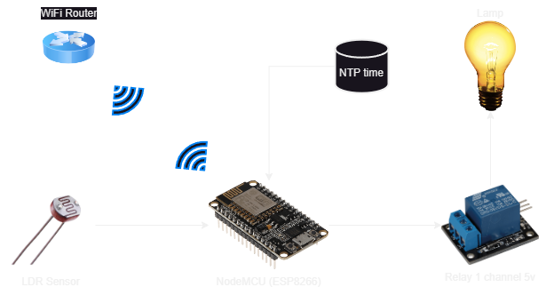

## Project Overview
The schematic diagram illustrates the interconnectedness of various IoT devices, including an ESP8266 microcontroller, an LDR sensor, a 5V 1-channel relay, a lamp, an NTP time module, and a WiFi router. At the center of the diagram is the ESP8266, serving as the main control unit. The LDR sensor detects ambient light levels and sends this information to the ESP8266. Based on the sensor readings, the ESP8266 triggers the 5V 1-channel relay to control the lamp, either turning it on or off. The NTP time module allows the ESP8266 to synchronize its internal clock with the global time server, ensuring accurate time-based operations. Finally, the WiFi router facilitates the communication between the ESP8266 and other connected devices, enabling remote control and monitoring of the IoT system. Together, these components form an integrated network, enabling automated and responsive functionality for the IoT system.

