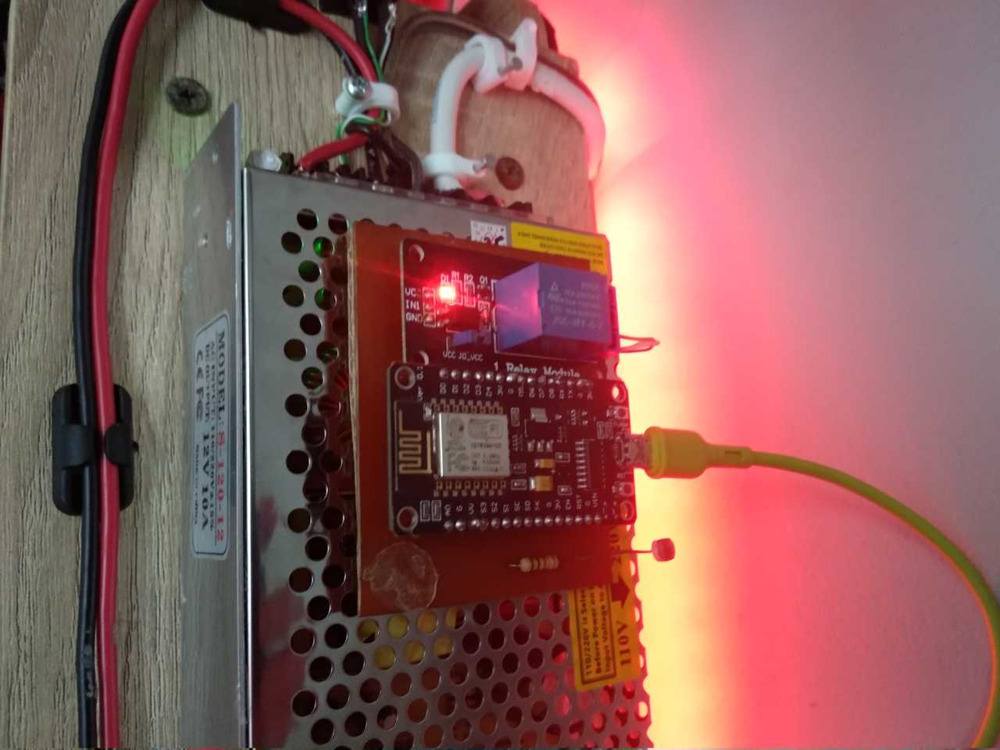

<h3 align="center">spothings</h3>

Make everything automatic and make things easier.

---

## About Project
I have created this project solely for exploring the features of the NodeMCU microcontroller (ESP8266) and fulfilling my desire to create an automatic backlight for my desk that adjusts according to day and night time using an LDR sensor. Several variables are stored in the ESP8266 EEPROM to prevent data loss upon restart. Additionally, I have incorporated a Telegram bot as an alternative method for remote control. I may consider adding more features in the future.

## Feature
What does this device do? In simple terms, if it is night and there is enough light, the relay will activate so that the backlight lamp on the table turns on, otherwise if it is dark, it is time to sleep and the backlight will turn off. During the day it will turn off the relay and activity detection light to save energy.
- [Current](https://github.com/spothings/strip-table/releases)
	- [x] Turn on and off the lights using relay
	- [x] Use NTP client to get value day or night
	- [x] Using the LDR sensor to get the light intensity
	- [x] Using average light intensity for stability sensor readings
	- [x] Make auto sampling dark value
	- [x] Use pointer for function
- [Development](https://github.com/spothings/strip-table/tree/dev-code)
	- [x] Using Telegram bot for remote control
	- [x] Using EEPROM to store data
	- [ ] Use Webserver

### NodeMCU ESP8266 Specifications & Features
- Microcontroller: Tensilica 32-bit RISC CPU Xtensa LX106
- Operating Voltage: 3.3V
- Input Voltage: 7-12V
- Digital I/O Pins (DIO): 16
- Analog Input Pins (ADC): 1
- UARTs: 1
- SPIs: 1
- I2Cs: 1
- Flash Memory: 4 MB
- SRAM: 64 KB
- Clock Speed: 80 MHz
- EEPROM size: 4kB
- USB-TTL based on CP2102 is included onboard, Enabling Plug n Play
- PCB Antenna
- Small Sized module to fit smartly inside your IoT projects

## Content
- [Documentation](/doc)
- [Project Workflow](/flow)
- [Source Code](/src/main)
- [Board Schematic](/sch)
- [PCB and Gerber File](/pcb)

## Contributor

## Donation
If you think this project is helpful, you can make a donation. For those of you who want to make a donation, we would really appreciate it. Donations can be made through [Buy Me a Coffee](https://www.buymeacoffee.com/bukanspot) and [PayPal](https://paypal.me/bukanspot).

## License
This project is owned by [spothings](https://github.com/spothings). Copyright, Privacy Policy and License also sourced from there.
